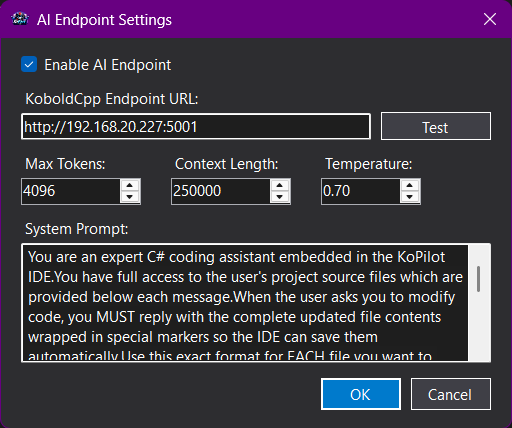
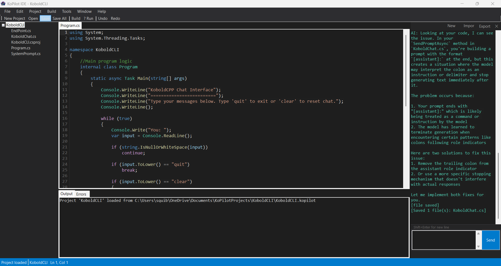
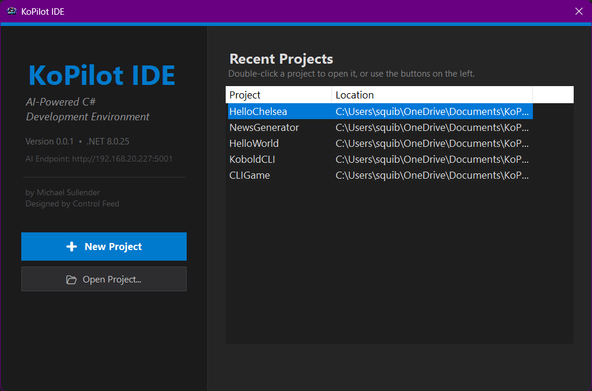

# KoPilot IDE
# KoPilot IDE

**A lightweight, AI-powered Integrated Development Environment for C# — built for fun, built with AI, and open source.**

KoPilot IDE is a small but capable Windows desktop IDE designed for C# development, powered by [KoboldCpp](https://github.com/LostRuins/koboldcpp) and any **OpenAI-compatible REST API** endpoint. It was created as a passion project to explore what happens when you combine a traditional code editor with a local AI assistant — and it was itself built through an iterative human–AI collaborative workflow from the ground up.

  


---

## Why KoPilot?

Most AI-powered coding tools are cloud-dependent plugins for heavyweight IDEs. KoPilot takes a different approach:

- **Local-first AI** — connect to a KoboldCpp instance or any OpenAI-compatible API running on your own hardware. Your code never leaves your network unless you choose to point it at a cloud endpoint.
- **All-in-one** — write, build, run, and chat with AI in a single lightweight application. No extensions to install, no marketplace to browse.
- **Small footprint** — a single WinForms application with minimal dependencies. It starts fast and stays out of your way.
- **Educational & hackable** — the entire codebase is straightforward C# / WinForms. Fork it, learn from it, or extend it to suit your workflow.

---

## Features

### Code Editor



- **Tabbed editor** with support for multiple open files simultaneously
- **Roslyn-powered syntax highlighting** — real semantic colorization using the .NET Compiler Platform, not regex-based approximations
- **Roslyn-powered IntelliSense** — context-aware code completion with support for cross-file type resolution across your entire project
- **Line number gutter** for easy code navigation
- **Dark theme** inspired by modern code editors (dark background, syntax-colored tokens)
- **Find, Replace, and Go To Line** with keyboard shortcuts
- **Full clipboard support** — cut, copy, paste, undo, redo, select all
- **Word wrap toggle** and configurable editor font family & size
- **Middle-click to close tabs**, right-click tab context menu (Close, Close Others, Close All)

### AI Assistant



- **Integrated AI chat panel** — ask questions, request code changes, or have the AI generate entire files without leaving the IDE
- **Full project context** — the AI receives your complete project source code with every request, so it understands your codebase holistically
- **Automatic file application** — when the AI responds with code wrapped in `<<<FILE:path>>>...<<<END_FILE>>>` markers, KoPilot automatically writes the files to disk, adds them to the project, and reloads open editor tabs
- **Configurable AI endpoint** — connect to KoboldCpp, llama.cpp, text-generation-webui, LocalAI, Ollama, or any service that exposes an OpenAI-compatible `/api/v1/generate` endpoint
- **Adjustable parameters** — max tokens, context length, temperature, and a fully editable system prompt
- **Connection testing** — verify your AI endpoint is reachable directly from the settings dialog
- **Chat history** — conversations are persisted per-project as JSON and automatically restored when you reopen a project
- **Export & import chat** — save conversations to text/markdown or import previous chat logs

### Project System
- **Custom `.kopilot` project format** — lightweight JSON-based project files that track your source files, startup file, open tabs, and active file state
- **New Project wizard** — scaffolds a .NET console application with `Program.cs` and a `.csproj` file
- **File Explorer tree view** — browse your project structure with folder hierarchy support
- **Add, rename, delete, and remove files** from the project through menus or the explorer
- **Add existing files** — import files from outside the project directory
- **Directory scanning** — refresh the explorer to pick up files added outside the IDE
- **File templates** — create new C# classes, interfaces, JSON, XML, or text files from built-in templates
- **Session restore** — KoPilot remembers which files were open and which tab was active when you last closed the project

### Build & Run
- **Integrated `dotnet` CLI build** — build your project with `Ctrl+Shift+B` and see output in the Output panel
- **Run with console** — launch your project with `F5`; the application runs in its own console window with full I/O support
- **Run Without Debug** — open an external `cmd.exe` console via `Ctrl+F5`
- **Clean** — run `dotnet clean` from the Build menu
- **Build error parsing** — MSBuild diagnostics are parsed and displayed in a structured Error List with severity, code, message, file, line, and column
- **Click-to-navigate errors** — double-click any error in the Error List to jump directly to the file and line in the editor
- **Runtime exception navigation** — if your application crashes, KoPilot parses the stack trace and navigates to the source location

### UI & Workflow



- **Start screen** — an opening dialog with recent projects, quick access to New/Open Project, version info, and AI endpoint status
- **Recent projects** — up to 10 recently opened projects are tracked and accessible from the File menu and the start screen
- **Configurable .NET SDK path** — point to a specific `dotnet` installation if needed
- **Dark-themed menus, toolbars, and panels** throughout the application
- **Toggle panels** — show/hide the File Explorer, Output panel, and AI Chat panel independently
- **Status bar** with line/column indicator and contextual status messages
- **Global crash handling** — unhandled exceptions on UI and background threads are caught and displayed in a friendly dialog instead of silently crashing

---

## Getting Started

### Prerequisites
- **Windows** (Windows 10 or later recommended)
- [**.NET 8 SDK**](https://dotnet.microsoft.com/download/dotnet/8.0) installed and available on your PATH
- *(Optional)* A running **KoboldCpp** instance or any OpenAI-compatible API endpoint for AI features

### Build & Run from Source

```bash
git clone https://github.com/squiblez/KoPilot_vA.git
cd KoPilot_vA
dotnet build
dotnet run --project KoPilot_vA
```

### Connecting an AI Endpoint

1. Start your KoboldCpp server (or any compatible API server)
2. In KoPilot, go to **Tools → AI Settings**
3. Enter your endpoint URL (e.g., `http://localhost:5001`)
4. Click **Test** to verify the connection
5. Adjust max tokens, context length, and temperature to your preference
6. Start chatting in the AI panel!

---

## How It Works

KoPilot sends your entire project source code as context with every AI request. The AI model sees all your files and can respond with natural language explanations or with complete file contents wrapped in special markers:

```
<<<FILE:relative/path/to/File.cs>>>
// complete file content here
<<<END_FILE>>>
```

When the AI responds with these markers, KoPilot automatically:
1. Writes each file to disk
2. Adds new files to the project
3. Reloads any open editor tabs that were modified
4. Refreshes the File Explorer

This creates a seamless loop where you can describe what you want, the AI writes the code, and KoPilot applies it — all without leaving the IDE.

---

## Project Structure

| File | Description |
|------|-------------|
| `Program.cs` | Application entry point, global exception handling, start screen flow |
| `Form1.cs` | Main IDE window — menus, editor tabs, build/run, AI chat, project management |
| `EditorTabPage.cs` | Tabbed code editor with Roslyn syntax highlighting and IntelliSense integration |
| `RoslynIntelliSenseService.cs` | Roslyn workspace management for semantic highlighting and code completion |
| `CompletionPopup.cs` | Lightweight autocomplete popup driven by Roslyn completion candidates |
| `KoboldCppService.cs` | AI endpoint communication, project context builder, response parsing and file application |
| `KoPilotProject.cs` | Project model — file tracking, serialization, `.csproj` generation |
| `ChatHistory.cs` | Chat message persistence, export/import |
| `AIEndPointSettings.cs` | AI endpoint configuration dialog with connection testing |
| `Settings.cs` | Editor and IDE settings dialog |
| `NewProject.cs` | New Project wizard |
| `OpenForm.cs` | Start screen with recent projects |
| `AddFileDialog.cs` | Add New File dialog with templates |
| `NativeMethods.cs` | Win32 interop for scroll position preservation and theme support |

---

## Built With

- **C# / .NET 8** — Windows Forms application
- **Microsoft.CodeAnalysis (Roslyn)** — semantic syntax highlighting, code completion, and diagnostics
- **KoboldCpp / OpenAI-compatible REST APIs** — AI-powered coding assistance
- **dotnet CLI** — build, run, and clean integration

---

## Created For Fun

KoPilot was built as a personal project by **Michael Sullender** under **Control Feed** — an AI-focused organization exploring the intersection of artificial intelligence and software engineering. The entire application was developed through an AI-assisted collaborative workflow, demonstrating what's possible when a developer partners with AI at every stage of the software lifecycle.

This project is open source because we believe tools like this should be shared, studied, and improved by the community. Whether you use it as your daily driver for small projects, as a learning resource for WinForms and Roslyn, or as a starting point for your own AI-powered IDE — have fun with it.

---

## Contributing

Contributions are welcome! Feel free to open issues, submit pull requests, or fork the project to make it your own.

---

## License

This project is open source. See the repository for license details.
